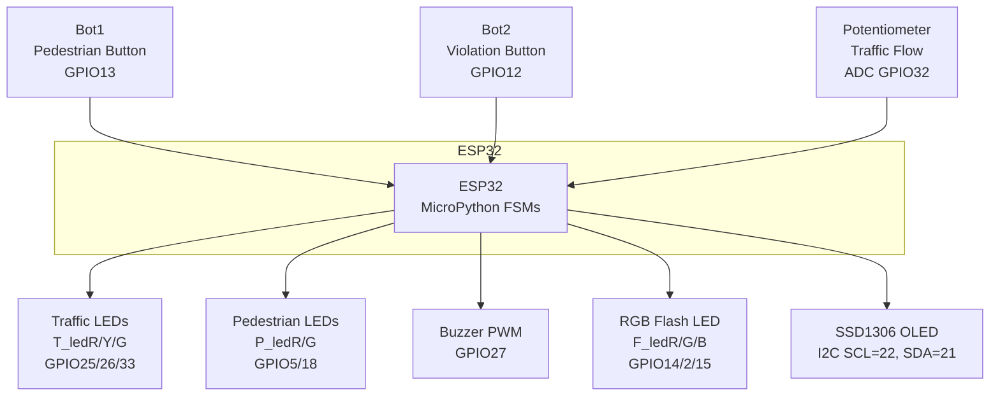

# 🚦 Pedestrian Traffic Light System (ESP32 + MicroPython)
This project implements a **pedestrian-crossing traffic light** using an **ESP32** and **MicroPython**, featuring:

- Adaptive timing based on traffic flow  
- Audible signaling (PWM buzzer)
- OLED LCD messages  
- Red-light violation detection  
- RGB LED flash simulating picture capture  
- Fully non-blocking Finite State Machines (FSMs)

Ideal for educational use, embedded systems learning, and smart-city prototyping.

All subsystems run **simultaneously** using a **non-blocking architecture** based on FSMs.
---
### 🎓 Educational Origin
This project was originally created while I was teaching the 
"Programming and Data Structures" course. It was designed to help 
students understand real-world applications of finite state machines, 
modular design, and embedded programming
using the ESP32.
---

## 🧱 System Block Diagram

---

# ⚙️ Main Features

## 🎛️ Pedestrian Button Logic
- Pressing the button triggers:
  - A **confirmation double-beep**
  - A validated crossing request
- The waiting time before green varies from **10 to 60 seconds**
  - **More traffic = longer waiting time**
  - **Less traffic = shorter waiting time**

---

## 🟢 Pedestrian Signal Phase

When pedestrian light switches to *green*:

- A **sound signal** is generated
- OLED displays: *"Safe to cross"*
- A **countdown timer** shows remaining crossing time
- Pedestrian green lasts **10–40 seconds**
  - **More traffic = shorter crossing window**
  - **Less traffic = longer crossing window**

---

## 🔊 Adaptive Audible Signaling
While pedestrian light is green:

- The buzzer emits **periodic beeps**
- Beep interval decreases as time runs out  
  → Helps visually impaired users estimate remaining time  
- Non-blocking PWM-based audio pulses  
  → System remains responsive

---

## 🚨 Red-Light Violation Detection

If a vehicle (simulated by button) crosses while traffic light is red:

- An RGB LED flashes **white** to simulate a photo capture  
  *(no real camera is used)*
- The **fines** counter is incremented 

---

# 🚗 Traffic Flow Measurement

Traffic flow is **simulated via a potentiometer** connected to ADC:

| Value | Meaning |
|------|---------|
| 0.0  | No cars / light traffic |
| 1.0  | Heavy traffic |

Flow affects:

- ⏱️ **Wait before pedestrian green**  
  → 10–60 seconds  
- 🟢 **Pedestrian green duration**  
  → 10–40 seconds  

### In a real system, flow could be measured using:

- 🔦 Infrared vehicle counters  
- 📡 Ultrasonic presence sensors  
- 🧲 Magnetic/inductive road sensors  
- 🎥 Computer vision

The recorded flow is mapped to a 0.0–1.0 value used by the FSM.

---

#  Finite State Machines (FSMs)

This project uses multiple **non-blocking FSMs** running in parallel.
ALL these FSMs run without `sleep` blocking the main loop.  
This architecture keeps the whole system responsive.

---

# 🖥️ Hardware Used

- **ESP32 Dev Module**
- **SSD1306 OLED** (I2C: 0x3C)
- **Passive Buzzer** (PWM controlled)
- **RGB LED**
- **Pedestrian LEDs (Red/Green)**
- **Traffic LEDs (Red/Yellow/Green)**
- **Push Button (Pedestrian)**
- **Push Button (Violation Simulator)**
- **Potentiometer** (traffic flow input)

---

# 📈 Future Improvements

- Add real traffic sensors (IR, camera, etc.)
- Log violations to an SD card
- Add Wi-Fi dashboard for remote monitoring

